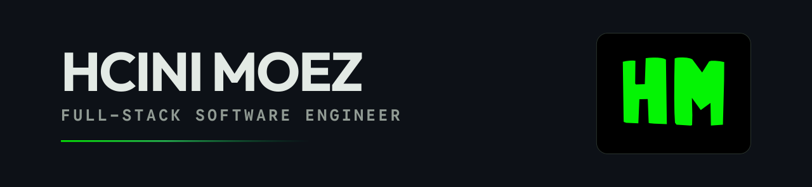
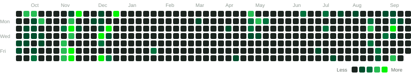
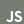

<picture>
  <source media="(prefers-color-scheme: dark)" srcset="./assets/hero-dark.svg">
  <source media="(prefers-color-scheme: light)" srcset="./assets/hero-light.svg">
  
</picture>

<p align="center">Full-stack software engineer in Tunisia, taking products from the first user flow to production — interface, API, data, and the AI and realtime services in between.</p>

<p align="center">
  <a href="https://www.hcinimoez.com"><b>Portfolio</b></a>
  &nbsp;&nbsp;·&nbsp;&nbsp;
  <a href="https://cal.com/hcini-moez-hcj5xe/45-minutes-meeting"><b>Book a call</b></a>
  &nbsp;&nbsp;·&nbsp;&nbsp;
  <a href="mailto:book@hcinimoez.com"><b>Email</b></a>
  &nbsp;&nbsp;·&nbsp;&nbsp;
  <a href="https://www.linkedin.com/in/hcini-moez-9013242aa/"><b>LinkedIn</b></a>
</p>

## 01 — What I do

<picture>
  <source media="(prefers-color-scheme: dark)" srcset="./assets/contributions-dark.svg">
  <source media="(prefers-color-scheme: light)" srcset="./assets/contributions-light.svg">
  
</picture>

<table>
  <tr>
    <td width="416" valign="top">
      <b>Product engineering</b><br />
      <sub>From discovery and UX flows to deployment and iteration.</sub>
    </td>
    <td width="416" valign="top">
      <b>Cross-platform</b><br />
      <sub>Consistent experiences across Flutter mobile and Next.js web.</sub>
    </td>
  </tr>
</table>

<table>
  <tr>
    <td width="416" valign="top">
      <b>Applied AI</b><br />
      <sub>Generative content, career intelligence, voice, and automation.</sub>
    </td>
    <td width="416" valign="top">
      <b>Realtime systems</b><br />
      <sub>Auth, chat, notifications, synchronized sessions, and live data.</sub>
    </td>
  </tr>
</table>

<p>
  <b>Interface</b><br />
  &nbsp;Flutter&nbsp;&nbsp;&nbsp; &nbsp;Dart&nbsp;&nbsp;&nbsp; &nbsp;React&nbsp;&nbsp;&nbsp; &nbsp;Next.js&nbsp;&nbsp;&nbsp; &nbsp;TypeScript&nbsp;&nbsp;&nbsp; &nbsp;JavaScript&nbsp;&nbsp;&nbsp; &nbsp;Tailwind
</p>

<p>
  <b>Services & data</b><br />
  &nbsp;Go&nbsp;&nbsp;&nbsp; &nbsp;Node.js&nbsp;&nbsp;&nbsp; &nbsp;Supabase&nbsp;&nbsp;&nbsp; &nbsp;PostgreSQL&nbsp;&nbsp;&nbsp; &nbsp;Firebase&nbsp;&nbsp;&nbsp; &nbsp;REST&nbsp;APIs&nbsp;&nbsp;&nbsp; &nbsp;Realtime
</p>

<p>
  <b>AI & automation</b><br />
  &nbsp;Gemini&nbsp;AI&nbsp;&nbsp;&nbsp; &nbsp;n8n
</p>

<p>
  <b>Delivery</b><br />
  &nbsp;Docker&nbsp;&nbsp;&nbsp; &nbsp;Git&nbsp;&nbsp;&nbsp; &nbsp;GitHub&nbsp;&nbsp;&nbsp; &nbsp;Vercel&nbsp;&nbsp;&nbsp; &nbsp;Figma&nbsp;&nbsp;&nbsp; &nbsp;Linux
</p>

## 02 — How I build

```text
Understand the problem → Design the flow → Engineer the system → Ship → Learn → Improve
```

- I start with the user journey, not the framework.
- I build complete vertical slices across interface, API, data, and infrastructure.
- I treat responsiveness, security, performance, analytics, and release quality as product features.
- I use AI where it creates genuine leverage — not where it only adds a label.

> I care about the details users feel and the systems they never have to think about.

---

<p align="center">
  
</p>

<p align="center">Open to ambitious <b>full-stack</b>, <b>Flutter</b>, and <b>product engineering</b> work — especially products that pair thoughtful UX with technically interesting systems.</p>

<p align="center">
  <a href="https://www.hcinimoez.com"><b>Portfolio</b></a>
  &nbsp;&nbsp;·&nbsp;&nbsp;
  <a href="https://cal.com/hcini-moez-hcj5xe/45-minutes-meeting"><b>Book a call</b></a>
  &nbsp;&nbsp;·&nbsp;&nbsp;
  <a href="mailto:book@hcinimoez.com"><b>Email</b></a>
</p>

<p align="center"><sub>Tunisia · Building since 2018 · Open to work</sub></p>
