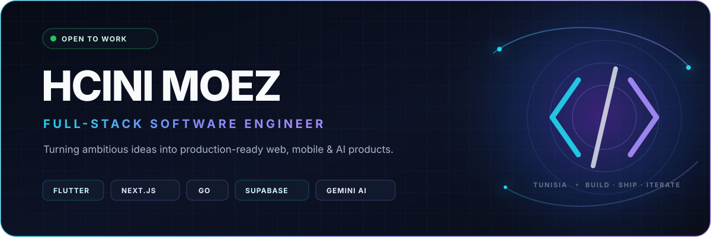

<p align="center">
  
</p>

<p align="center">
  <a href="https://www.hcinimoez.com"></a>
  <a href="mailto:book@hcinimoez.com"></a>
  <a href="https://www.linkedin.com/in/hcini-moez-9013242aa/"></a>
  <a href="https://calendly.com/moezhcini/booking-a-call"></a>
</p>

<p align="center">
  <samp>Web products&nbsp; · &nbsp;Mobile apps&nbsp; · &nbsp;Applied AI&nbsp; · &nbsp;Production systems</samp>
</p>

## `01 / ABOUT`

I’m **Hcini Moez**, a Mid-Level Full-Stack Software Engineer from Tunisia. I take products from the first user flow to production—shaping the experience, engineering the frontend and backend, integrating AI and realtime services, and shipping across web, iOS, and Android.

My work sits at the intersection of **clean product design**, **reliable engineering**, and **real business value**. I care about the details users feel and the systems they never have to think about.

<table>
  <tr>
    <td align="center" width="33%"><strong>21+</strong><br /><sub>apps built</sub></td>
    <td align="center" width="33%"><strong>1,000+</strong><br /><sub>screens crafted</sub></td>
    <td align="center" width="33%"><strong>2,000+</strong><br /><sub>flows designed</sub></td>
  </tr>
</table>

> Most of my production work lives in private or client-owned repositories. The live products below are the clearest view of what I design, engineer, and ship.

## `02 / FEATURED PRODUCTS`

<table>
  <tr>
    <td width="50%" valign="top">
      <h3><a href="https://www.traidmatch.com/">TraidMatch ↗</a></h3>
      <p><strong>Vehicle trading, redesigned.</strong></p>
      <p>A platform where owners and verified dealers discover compatible vehicles, match, and negotiate trade offers.</p>
      <p><code>Flutter</code> <code>Next.js</code> <code>TypeScript</code> <code>Supabase</code> <code>PostgreSQL</code> <code>Firebase</code></p>
    </td>
    <td width="50%" valign="top">
      <h3><a href="https://www.koulpass.com/">Koulpass ↗</a></h3>
      <p><strong>Membership perks for everyday Tunisia.</strong></p>
      <p>A consumer and partner ecosystem for discovering and claiming exclusive offers across food, retail, and lifestyle.</p>
      <p><code>Flutter</code> <code>Next.js</code> <code>TypeScript</code> <code>Supabase</code> <code>PostgreSQL</code> <code>Firebase</code></p>
    </td>
  </tr>
  <tr>
    <td width="50%" valign="top">
      <h3><a href="https://www.uphire.io/">UpHire ↗</a></h3>
      <p><strong>An AI career copilot.</strong></p>
      <p>A career platform for ATS analysis, CV improvement, tailored cover letters, and realistic interview practice.</p>
      <p><code>Flutter</code> <code>Next.js</code> <code>TypeScript</code> <code>Supabase</code> <code>Firebase</code> <code>Gemini AI</code></p>
    </td>
    <td width="50%" valign="top">
      <h3><a href="https://tellostory.com/">Tello ↗</a></h3>
      <p><strong>Stories that grow with every child.</strong></p>
      <p>An AI storytelling platform that creates personalised, interactive stories with branching adventures and audio.</p>
      <p><code>Flutter</code> <code>Go</code> <code>PostgreSQL</code> <code>Supabase</code> <code>Firebase</code> <code>Gemini AI</code></p>
    </td>
  </tr>
</table>

## `03 / ENGINEERING FOCUS`

<table>
  <tr>
    <td width="25%" valign="top"><strong>Product engineering</strong><br /><sub>From discovery and UX flows to deployment and iteration.</sub></td>
    <td width="25%" valign="top"><strong>Cross-platform</strong><br /><sub>Consistent experiences across Flutter mobile and Next.js web.</sub></td>
    <td width="25%" valign="top"><strong>Applied AI</strong><br /><sub>Generative content, career intelligence, voice, and automation.</sub></td>
    <td width="25%" valign="top"><strong>Realtime systems</strong><br /><sub>Auth, chat, notifications, synchronized sessions, and live data.</sub></td>
  </tr>
</table>

## `04 / TOOLKIT`

<p align="center">
  
</p>
<p align="center">
  
</p>
<p align="center">
  
  
  
  
</p>

## `05 / EXPERIENCE`

| Period | Team | Role |
| :-- | :-- | :-- |
| **Nov 2025 — Present** | **TEKBH** · La Marsa, Tunisia | Full-Stack Software Engineer |
| **Nov 2023 — Jul 2025** | **Sandlist AI** · On-site | Mobile Developer |
| **2018 — Present** | **Independent** · Remote | Freelance Software & Product Developer |

## `06 / HOW I BUILD`

```text
Understand the problem → Design the flow → Engineer the system → Ship → Learn → Improve
```

- I start with the user journey, not the framework.
- I build complete vertical slices across interface, API, data, and infrastructure.
- I treat responsiveness, security, performance, analytics, and release quality as product features.
- I use AI where it creates genuine leverage—not where it only adds a label.

## `07 / LET’S BUILD`

I’m open to ambitious **full-stack**, **Flutter**, and **product engineering** opportunities—especially products that combine thoughtful UX with technically interesting systems.

<p align="center">
  <a href="https://www.hcinimoez.com"><strong>Explore my portfolio</strong></a>
  &nbsp;·&nbsp;
  <a href="https://calendly.com/moezhcini/booking-a-call"><strong>Book a call</strong></a>
  &nbsp;·&nbsp;
  <a href="mailto:book@hcinimoez.com"><strong>Send an email</strong></a>
</p>

<p align="center">
  <sub>Designed with intent. Engineered in Tunisia. Shipped for the world.</sub>
</p>

